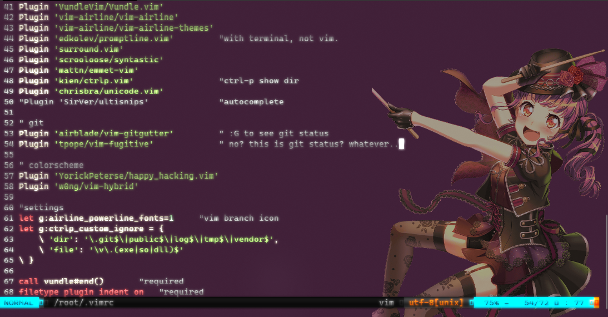

# vimsetting
backup for .vimrc & (windows terminal)setting.json

## see
background color: ubuntu violet(purple?)
character there: Ako from BangDream!

## how to use
>i. location:
  
    ~/.vimrc

>ii. unzip RoamingState.zip at:

    C:\Users\[Your Account]\AppData\Local\Packages\Microsoft.WindowsTerminal_8wekyb3d8bbwe\RoamingState

>iii. paste settings.json to your one.

-------------
memo.

//Learn Vimscript the Hard Way
http://learnvimscriptthehardway.stevelosh.com/

//meaningless, just pasted
git clone https://github.com/YuiLovesTomato/dotfiles.git .vimrc
